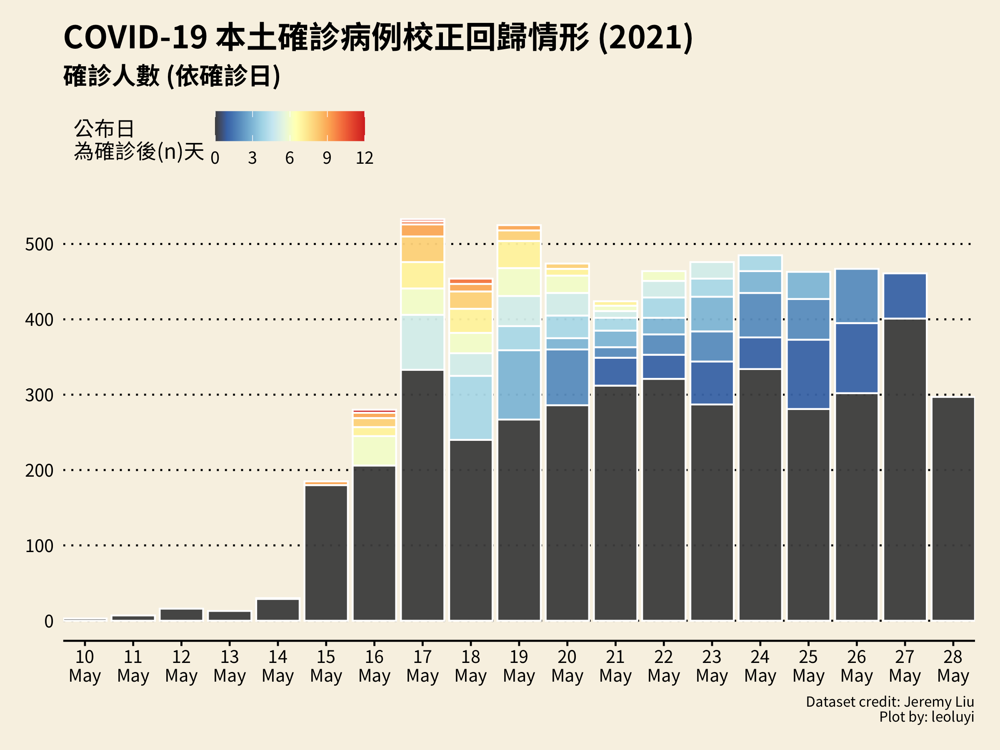
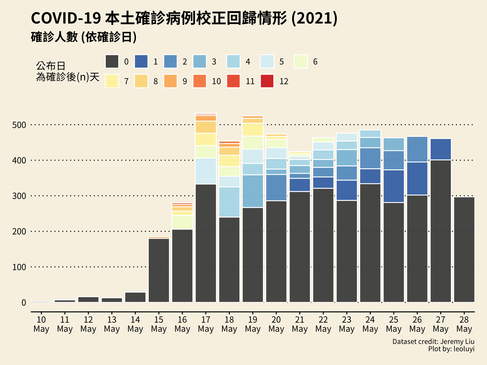
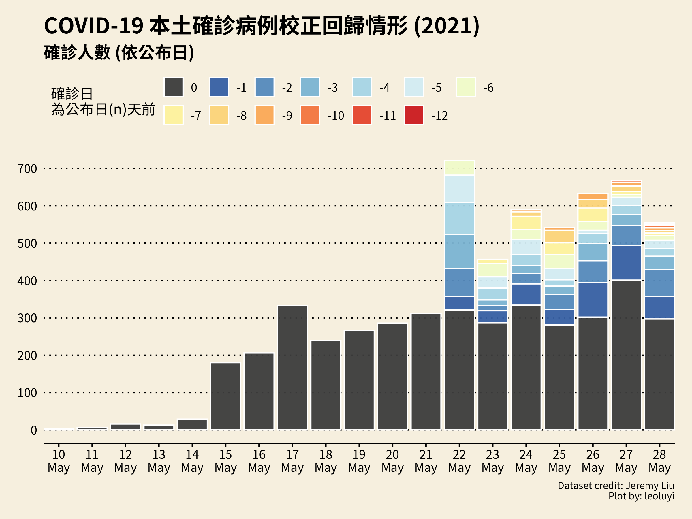

# Visualisation of COVID-19 Cases in Taiwan

Some visualisation works of the datasets about confirmed cases.

If you want to contribute to a project and make it better, your help is very welcome.

## Getting Started

```R
install.packages(
  "magrittr",
  "readr",
  "tidyverse",
  "RColorBrewer",
  "ggthemes"
)
```

## Plots







## Datasets

- [covid19_modified_twdata_20210528.csv](https://drive.google.com/file/d/1vyNYDtiNAIwHGKo31cjjMys7hi6OxJuu/view?fbclid=IwAR0RzHfE9JRL4wfW-quXSrX5dcAJ_8mNMHhOSBFE8I__d5KppdW9NiNPw9k)

## References

- [Taiwan CDC](https://www.cdc.gov.tw/)
- [Our World in Data - Coronavirus Pandemic (COVID-19)](https://ourworldindata.org/coronavirus)

## License

FREE, see [LICENSE](./LICENSE).

## Development Guidelines

We try to follow the [GitHub flow](https://guides.github.com/introduction/flow/) for development.

1. Fork this repo and clone it to your computer. To learn more about this process, see [this guide](https://guides.github.com/activities/forking/).
2. If you have forked and cloned the project before and it has been a while since you worked on it, [pull changes from the original repo](https://docs.github.com/en/github/collaborating-with-pull-requests/working-with-forks/merging-an-upstream-repository-into-your-fork) to your clone by using `git pull upstream main`.
3. Open the RStudio project file (`.Rproj`).
4. Make your changes:
    - Write your code.
    - Test your code (bonus points for adding unit tests).
    - Document your code (see function documentation above).
    - Check your code with `devtools::check()` and aim for 0 errors and warnings.
5. Commit and push your changes.
6. Submit a [pull request](https://guides.github.com/activities/forking/#making-a-pull-request).
